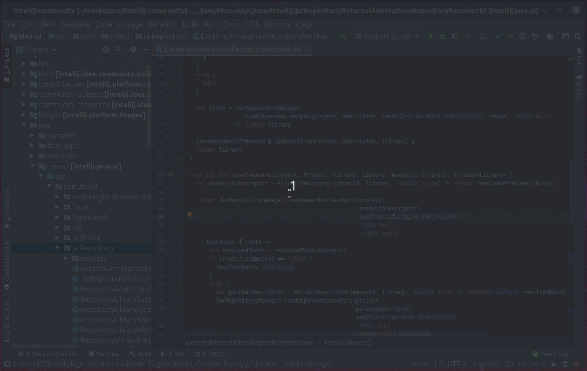
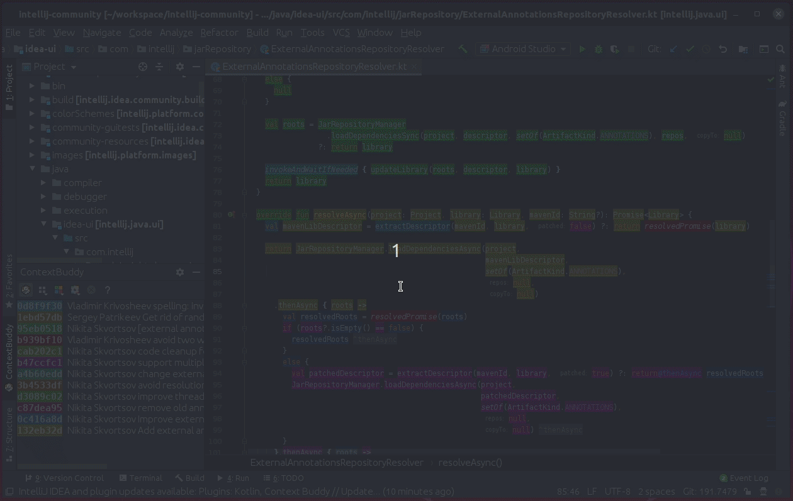
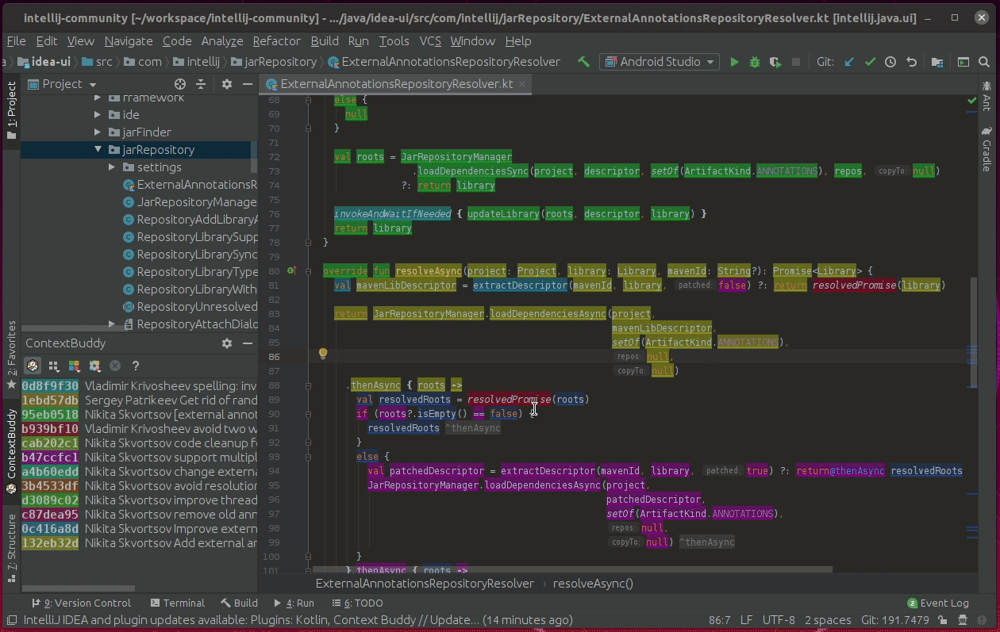

# Context Buddy

The tool, that allows you to inspect project history in more details. Context buddy analyze history based on tokens: method names, parameters, vars or words depending on language/format used rather then lines as git does.

It means that it assigns multiple commits to single line, ignores whitespace changes (if has no semantic meaning) or tracks renames properly.

If you are interested what is going under the hood please we've wrote a [blogpost](https://medium.com/@m.bednarz/165dac84425) about that.

## How to use Context Buddy

### Turning it on/off

Context buddy is off be default not to distract developer on daily basis. To turn on (and off) context buddy for given file simply run 'Smart History' action.

As you may notice it turns Context Buddy only for current file.

Another way to turn on/off Context Buddy it to use button in provided user interface.

### Highlights: Hovers and color

When turn on, Context buddy provides highlight tokens with hovers over each token in file. Tokens are highlighted according to last commit that affect it (see different options below).

Hover gives information about token, author, date as well as commit message. 

**Context buddy provides commits that actually changed given token so it may be different then commit that git blame provides**

### Hight by: change the way colors are applied

Context buddy can provide different way to assign colors to commits (and context where lastly changed by it).

Color settings can be changed using UI or provided actions.

Additionally we provide options that can configure colors even further.

Context Buddy can highlight code by (with options):

 * **Hash** - uniqe color will be assigned for each commit
   * **static** - each commit has the same commit assigned across all files (this may make colors less distinct among single file)
 * **Author** - unique color will be assigned for each commit with same author
   * **static** - each author has the same commit assigned across all files (this may make colors less distinct among single file)
 * **Months** - unique color will be assigned for each month as period of time so November 2018 and November 2019 will has different colors assigned
   * **static** - each month has the same commit assigned across all files (this may make colors less distinct among single file)
 * **History** - colors are picked from gradient based on git-history, so older commits will be assigned with color close to start of gradient and newer closer to end of it
   * **discrete** - colors will be picked using fixed step in gradient (1/N) rather then distance based on relative difference of commit times
   * **reverse** - reverses the ordering
   * **fade** - color will fade out for older commits
   * **color from and to** - colors to construct the gradient

### Select single commit

Context buddy present a list of all commits that affects current file and allows to highlight single commit (to e.g. analyze its impact). 

You can either select the commit once (so other commits are also highlighted) or twice (so only commit in question is highlighted).

   
