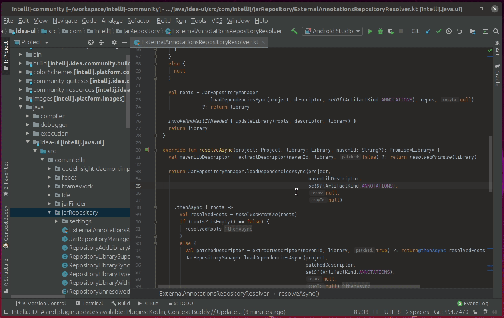
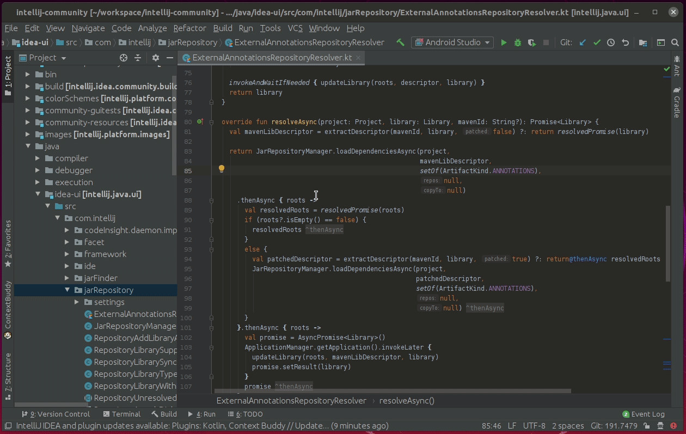
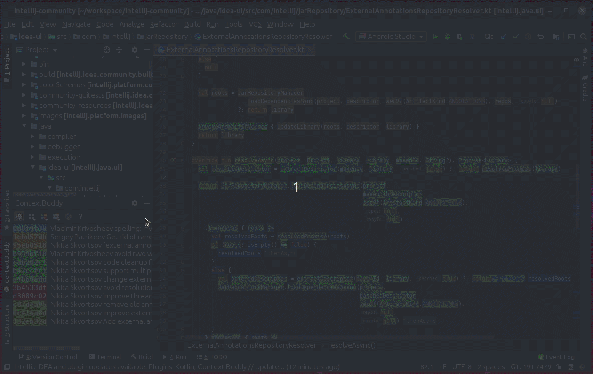
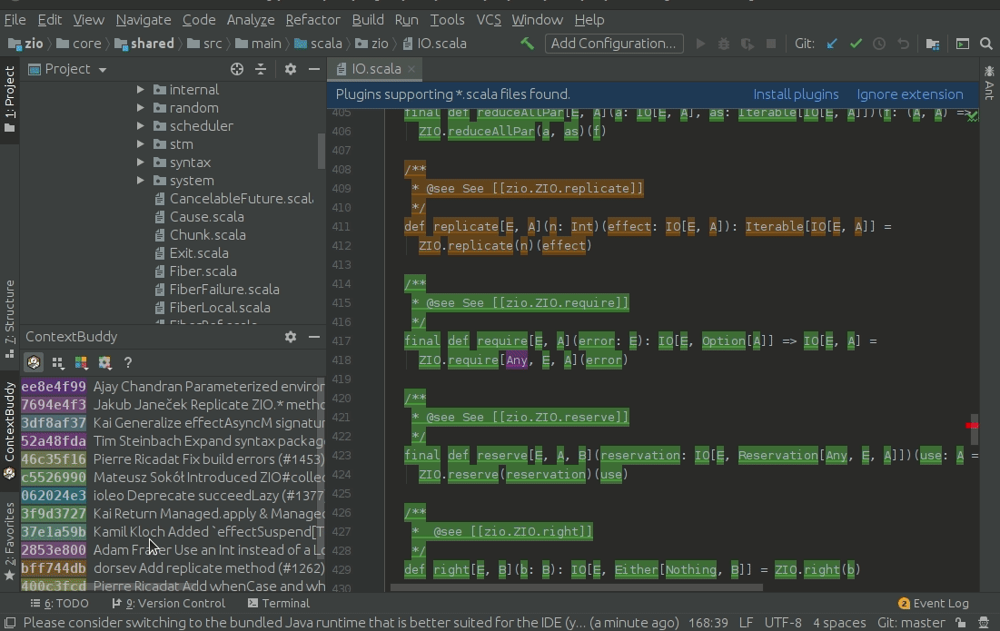

# Context Buddy

The tool, that allows you to inspect project history in more detail. Context Buddy analyzes history based on tokens: method names, parameters, vars or words depending on language/format used rather then lines as git does.

It means that it assigns multiple commits to a single line, ignores whitespace changes (if they have no semantic meaning) or tracks file renames properly.

If you are interested in what is going under the hood please we've written a [blogpost](https://medium.com/@m.bednarz/165dac84425) about that.

## How to use Context Buddy

### Turning it on/off

Context buddy is off by default so that it doesn’t distract the developer on a daily basis To turn on (and off) Context Buddy for a given file simply run 'Smart History' action.

As you may notice it turns Context Buddy only for current file.

Another way to turn on/off Context Buddy it to use button in the provided user interface.

### Highlights: Hovers and color

When turned on, Context buddy provides highlight tokens with hovers over each token in the file. Tokens are highlighted according to the last commit that affects it (see different options below).

Hover gives information about token, author, date as well as commit message. 

**Context buddy provides commits that actually changed given token so it may be different then commit that git blame provides**

### Highlight by: change the way colors are applied

Context buddy can provide different ways to assign colors to commits (and context where lastly changed by it).

Color settings can be changed using UI or provided actions.

Additionally, we provide options that can configure colors even further.

Context Buddy can highlight code by (with options):

 * **Hash** - unique color will be assigned for each commit
   * **static** - each commit has the same commit assigned across all files (this may make colors less distinct among single file)
 * **Author** - unique color will be assigned for each commit with the same author
   * **static** - each author has the same commit assigned across all files (this may make colors less distinct among single file)
 * **Months** - unique color will be assigned for each month as a period of time so November 2018 and November 2019 will have different colors assigned
   * **static** - each month has the same commit assigned across all files (this may make colors less distinct among single file)
 * **History** - colors are picked from gradient-based on git-history, so older commits will be assigned with a color close to starting of gradient and newer closer to end of it
   * **discrete** - colors will be picked using a fixed step in gradient (1/N) rather than distance based on relative difference of commit times
   * **reverse** - reverses the ordering
   * **fade** - color will fade out for older commits
   * **color from and to** - colors to construct the gradient

### Select single commit

Context buddy presents a list of all commits that affect the current file and allows us to highlight single commit (to e.g. analyze its impact). 

You can either select the commit once (so other commits are also highlighted) or twice (so only commit in question is highlighted).

   
